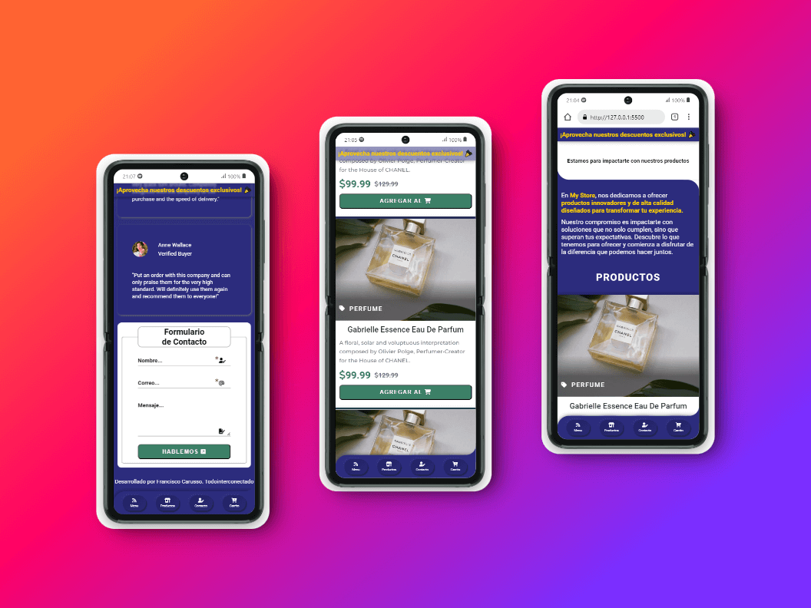

# 
 Proyecto Final - Tienda Online 

Este repositorio contiene el desarrollo de una tienda online funcional, diseñada como parte del curso Frontend de Talento Tech. El proyecto sigue buenas prácticas de desarrollo web, incluyendo el uso de **HTML5 semántico**, **CSS3**, **JavaScript** y un enfoque **Mobile First**. Se implementaron tecnologías como **Flexbox** y **Grid** para el diseño responsivo, y el formulario de contacto es gestionado por **Formspree**.

## Descripción General del Proyecto

El proyecto es una tienda online que permite visualizar productos, realizar búsquedas y contactarse con el administrador mediante un formulario de contacto. Se ha priorizado la **usabilidad**, **accesibilidad** y la **optimización SEO** en todo el desarrollo. El diseño se adapta a diferentes dispositivos para mejorar la experiencia de usuario en móviles y tablets.

## Estructura del Repositorio

Este repositorio incluye las siguientes secciones y archivos clave:

1. **[Pre-Entrega](./docs/PRE-ENTREGA.md)**: Detalla el progreso inicial del proyecto hasta la clase 8, cumpliendo con los requerimientos obligatorios del curso.
2. **[Entrega Final](./docs/ENTREGA-FINAL.md)**: Contiene la versión final del proyecto, con todas las funcionalidades implementadas y las mejoras sugeridas en las revisiones.
3. **`src/`**: Carpeta que contiene todo el código fuente del proyecto, incluyendo los archivos CSS y JavaScript.
4. **`assets/`**: Carpeta con las imágenes, íconos y otros recursos utilizados en la tienda online.

## Enlace al Proyecto

Puedes acceder a la versión desplegada de la tienda online a través del siguiente enlace:

 

### Tecnologías Utilizadas

- HTML5 Semántico
- CSS3
- JavaScript
- Flexbox y Grid
- Mobile First
- Formspree (para manejo de formularios)

## Arquitectura del proyecto

    
Ver Estructura del Proyecto

  <pre>
/my-store
├── <a href="./Index.html">Index.html</a>
├── <a href="./README.md">README.md</a>
├── <a href="./docs">/docs</a>
│   ├── <a href="./docs/PRE-ENTREGA.md">PRE-ENTREGA.md</a>
│   └── <a href="./docs/ENTREGA-FINAL.md">ENTREGA-FINAL.md</a>
├── <a href="./assets">/assets</a>
│   ├── <a href="./assets/favicon/">favicon</a>
│   └── <a href="./assets/images/">images</a>
└── <a href="./src">/src</a>
    ├── <a href="./src/js">/js</a>
    │   ├── <a href="./src/js/modules">/modules</a>
    │   │   └── <a href="./src/js/modules/api.mjs">api.mjs</a>
    │   └── <a href="./src/js/apps.mjs">apps.mjs</a>
    └── <a href="./src/css">/css</a>
        ├── <a href="./src/main.css">main.css</a>
        ├── <a href="./src/css/base">/base</a>
        │   └── <a href="./src/css/base/variables.css">variables.css</a>
        ├── <a href="./src/css/components" >/components</a>
        │   ├── <a href="./src/css/components/button.css">button.css</a>
        │   └── <a href="./src/css/components/card.css">card.css</a>
        └── <a href="./src/css/layout" >/layout</a>
            ├── <a href="./src/css/layout/footer.css">footer.css</a>
            ├── <a href="./src/css/layout/header.css">header.css</a>
            └── <a href="./src/css/layout/layout.css">layout.css</a>
  </pre>

> *Nota:* Puedes consultar los detalles del proceso de desarrollo en los archivos de la pre-entrega y la entrega final para obtener una descripción más detallada de los cambios y las implementaciones realizadas durante el curso.
